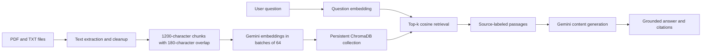

# Grounded Document Q&A (RAG)

A local question-answering app that searches PDF and TXT documents and answers questions using the retrieved passages. Ask questions in a browser interface or use the optional command-line interface. Answers are restricted to supplied sources and include labels that map to source filenames and PDF page numbers (or text chunk sections).

## Tech Stack

- Python 3.11 or newer
- Google Gen AI Python SDK 2.25.0 for embeddings and answer generation
- `gemini-embedding-001` for document and question embeddings
- ChromaDB 1.0.20 for persistent local vector storage with cosine distance
- pypdf 5.1.0 for PDF text extraction
- python-dotenv 1.0.1 for local environment configuration
- Streamlit for the browser-based question and answer interface
- ReportLab 4.2.5 for generating the included sample PDF (not needed to run the bot)

Install the pinned dependencies with `python -m pip install -r requirements.txt`.

## Architecture



The ingestion flow extracts text from each PDF page separately so page numbers remain available for citations. TXT files are treated as text sources and cited by chunk section. Re-running `ingest` replaces the contents of the local collection so removed or edited documents do not leave stale chunks behind. Embedding inputs are sent as batches of up to 64 texts, rather than one request per chunk.

## Chunking Strategy

The bot uses fixed-size character windows of up to 1,200 characters, preferring paragraph boundaries when they fall near the end of a window. Consecutive windows overlap by 180 characters to preserve context across boundaries. Character-based chunking is simple and predictable for a small mixed-format corpus; it does not guarantee equal token counts, so unusually long passages may be split mid-sentence.

## Embeddings and Vector Database

`gemini-embedding-001` provides retrieval-oriented vectors through Google's Gemini Developer API. Documents use the `RETRIEVAL_DOCUMENT` task type and questions use `RETRIEVAL_QUERY`. ChromaDB stores the vectors, source text, and metadata on disk under `.chroma/`; cosine distance is used for nearest-neighbor search. The chat model defaults to `gemini-3.8-flash` and can be changed with an environment variable. The vector store is local; embedding and answer generation require network access and a Gemini API key. Re-ingest documents after changing embedding providers or models.

## Included Documents

The `data/` folder contains four original documents, each longer than 500 words:

- `community_energy.pdf`: local energy systems, storage, participation, resilience, and governance
- `urban_heat.txt`: heat risk, cooling interventions, equity, and evaluation
- `secure_software.txt`: practical security practices across the software lifecycle
- `community_health.txt`: community health service design, privacy, partnerships, and evaluation

The PDF is generated by `python scripts/generate_sample_pdf.py`. Its source text is kept in that script so the sample corpus contains four documents rather than a duplicate TXT/PDF pair.

## Setup and Usage

1. Clone the repository and enter the project folder:

   ```powershell
   git clone <repository-url>
   cd RAG_AI_project
   ```

2. Create and activate a virtual environment, then install dependencies:

   ```powershell
   python -m venv .venv
   .\.venv\Scripts\Activate.ps1
   python -m pip install -r requirements.txt
   ```

   On macOS or Linux, activate with `source .venv/bin/activate`.

3. Create `.env` from the example and set your API key. Never commit `.env` or a real key:

   ```powershell
   Copy-Item .env.example .env
   ```

   Set `GEMINI_API_KEY` in `.env` to your Gemini API key from [Google AI Studio](https://aistudio.google.com/apikey).

4. Start the browser interface:

   ```powershell
   python -m streamlit run streamlit_app.py
   ```

   In the sidebar, select **Index documents** to build or refresh the local search index. Then ask questions in the chat box. The first indexing run and every answer require a Gemini API key and network access.

5. The command-line interface is also available:

   ```powershell
   python rag_bot.py ask "How can a city make cooling centers more accessible?"
   python rag_bot.py chat
   ```

   In chat mode, enter `exit` to quit. Use `python rag_bot.py ask --help` to see available options, including `--top-k`. To ingest another folder, pass `--data-dir path\to\documents`; PDF and TXT files are discovered recursively.

## Environment Variables

| Variable | Required | Default | Purpose |
|---|---|---|---|
| `GEMINI_API_KEY` | Yes | None | Authenticates Gemini embedding and generation calls |
| `GEMINI_CHAT_MODEL` | No | `gemini-3.8-flash` | Answer generation model |
| `GEMINI_EMBEDDING_MODEL` | No | `gemini-embedding-001` | Embedding model; use the same model for ingestion and queries |
| `CHROMA_PERSIST_DIR` | No | `.chroma` | Local persistent vector-store directory |

## Example Queries

- “What should a city measure to evaluate its heat action plan?” Expected theme: health outcomes, indoor temperatures, shade, service use, energy burden, and resident feedback.
- “When does a neighborhood battery improve resilience?” Expected theme: outage duration, critical loads, islanding equipment, battery capacity, and safe reconnection.
- “How should a small team handle production secrets?” Expected theme: avoid source control, use a secret manager or platform identity, limit access, and rotate after exposure.
- “What makes a community health referral successful?” Expected theme: clear responsibility, consent-aware warm handoffs, confirmation of the next step, and follow-up.
- “How can a community energy project avoid excluding renters?” Expected theme: alternative participation models, transparent eligibility, monitoring benefit distribution, and housing stability considerations.

## Known Limitations

- The system supports searchable text from PDF and TXT files only. Scanned PDFs without an OCR text layer are not readable, and DOCX is not supported.
- Retrieval uses embeddings and cosine similarity without reranking, hybrid keyword search, or an explicit relevance threshold; similar wording can still retrieve an unhelpful passage.
- Character windows are not token-aware and may split a sentence. PDF headers and footers are only lightly cleaned, and text extraction quality depends on the source PDF.
- The answer model can still make mistakes. The prompt asks it to abstain when evidence is missing, but citations do not independently prove that each claim is supported; review important answers against the cited passages.
- Gemini API access is required for ingestion and answers. Costs, rate limits, latency, and service availability depend on the selected account and models.
- The app is intended for local single-user use. It has no authentication, multi-user isolation, or production-grade monitoring.

## Tests

Run the offline unit tests for chunking and citation metadata with:

```powershell
python -m unittest discover -s tests -v
```

The tests do not call Gemini or require a populated vector database.